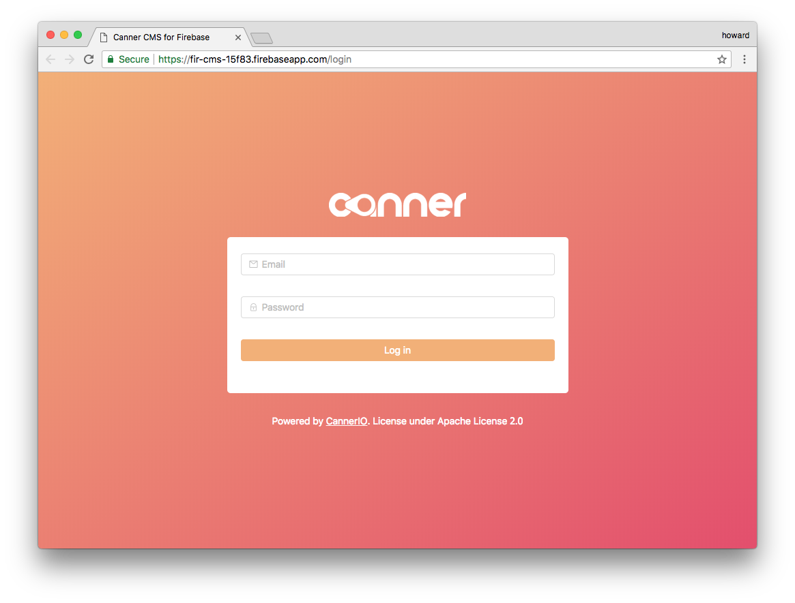
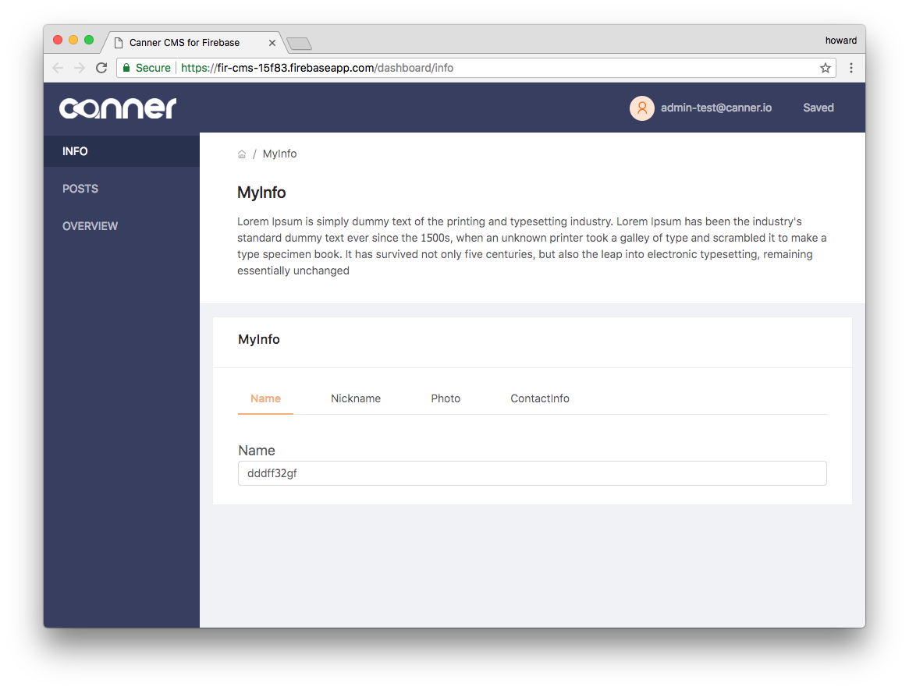
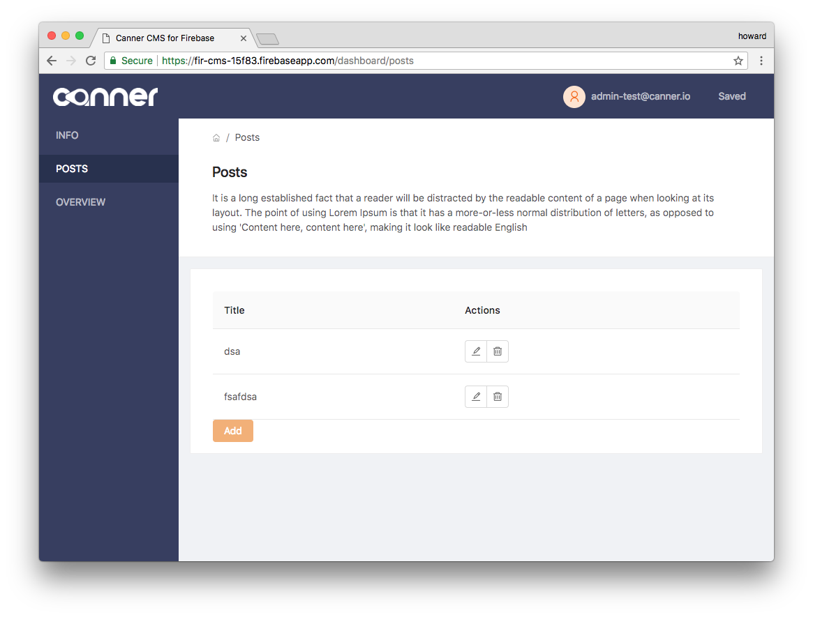

# canner-firebase-cms + NextJS

[](https://gitter.im/Canner/CannerCMS?utm_source=share-link&utm_medium=link&utm_campaign=share-link)

Canner CMS for Firebase with SSR supported (NextJS), for blog, ecommerce, mobile apps and even chatbot! This project is based on Canner, a open source CMS framework  https://www.canner.io/

## Deployment

### Now.sh

[](https://deploy.now.sh/?repo=https://github.com/canner/canner-firebase-cms)

or

```
$ now
```

### Firebase hosting

Modify `config-firebase.js` to your firebase settings and enter:

```
$ npm run export && npm run deploy:firebase
```

## Live demo

- Now: https://canner-firebase-cms-wwcucqckhx.now.sh/

- Firebase hosting: https://fir-cms-15f83.firebaseapp.com/login

## Tutorial

https://www.canner.io/docs/tutorial-community-firebase.html

## Preview






## How it works

It is based on Canner CMS framework (https://www.canner.io/), used `JSX` (canner-script) to declare how you Firebase data structure and UI in your CMS.

A simple blog post example:


Learn how to write schema [canner-script](https://www.canner.io/docs/guides-writing-schema.html)

## Import default user

```
firebase auth:import firebase-default-user.json
```

### Default user

- **Username:** admin-test@canner.io
- **Password:** admin-test

## Development

```
npm start
```

## Build script

```
npm run build
```

## License

Apache license 2.0